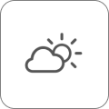
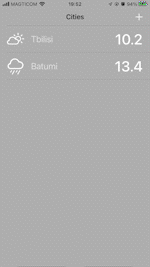

[![Swift Version][swift-image]][swift-url]

# Weather
 

  
  

    Test task weather forecast app
  

    

## Features

### Screen 1
Screen of saved cities. You need to implement TableView (or CollectionView). Cells should contain a weather icon, temperature and city name. 

### Screen 2
Screen for searching cities by their name. This screen should be presented modally. For searching cities you should use CLGeocoder.

### Screen 3
Screen for detailed weather forecast for the selected city. Use UIScrollView for screen implementation.

## Requirements

- Platform: iOS 13+
- Language: Swift 5+
- Architecture: MVP
- User Interface: UIKit, programmatically
- Network Layer: URLSession
- Weather API: Open Meteo
- Local Storage: Core Data

## Weather API

- Docs: https://open-meteo.com/en/docs
- API: https://api.open-meteo.com/v1/forecast

## Installation

Build and run in simulator or on a device using Xcode IDE

## Developer

Vladislav Glumov – [@LinkedIn](https://www.linkedin.com/in/vladislav-glumov)

[swift-image]: https://img.shields.io/badge/swift-5.0-orange.svg
[swift-url]: https://swift.org/
